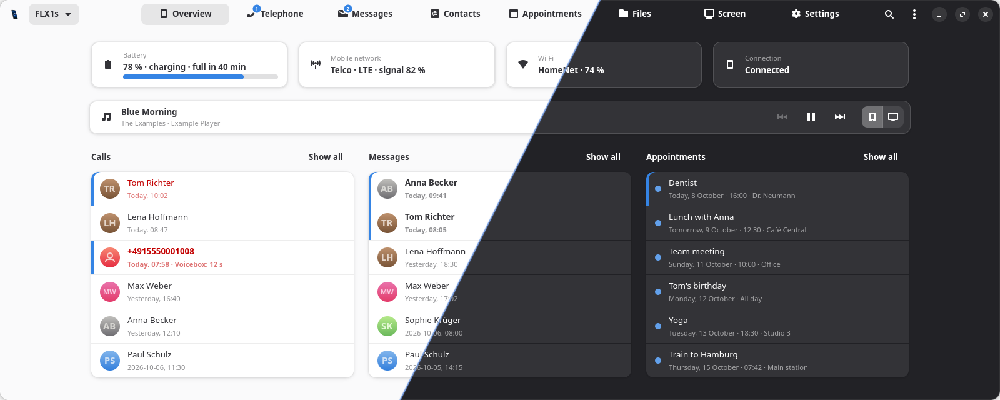
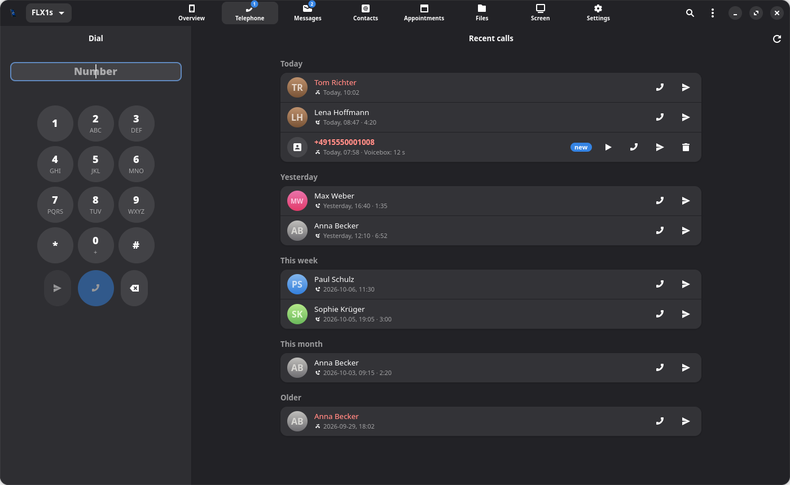
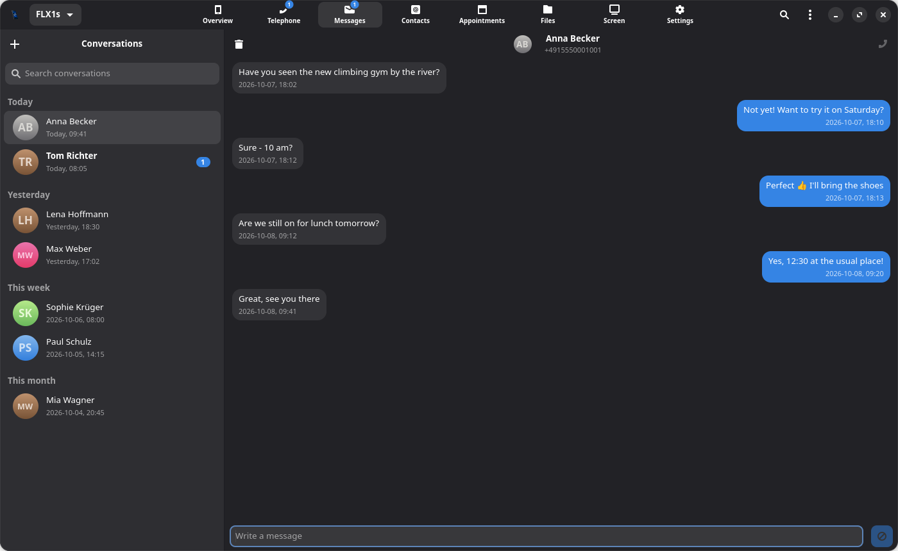
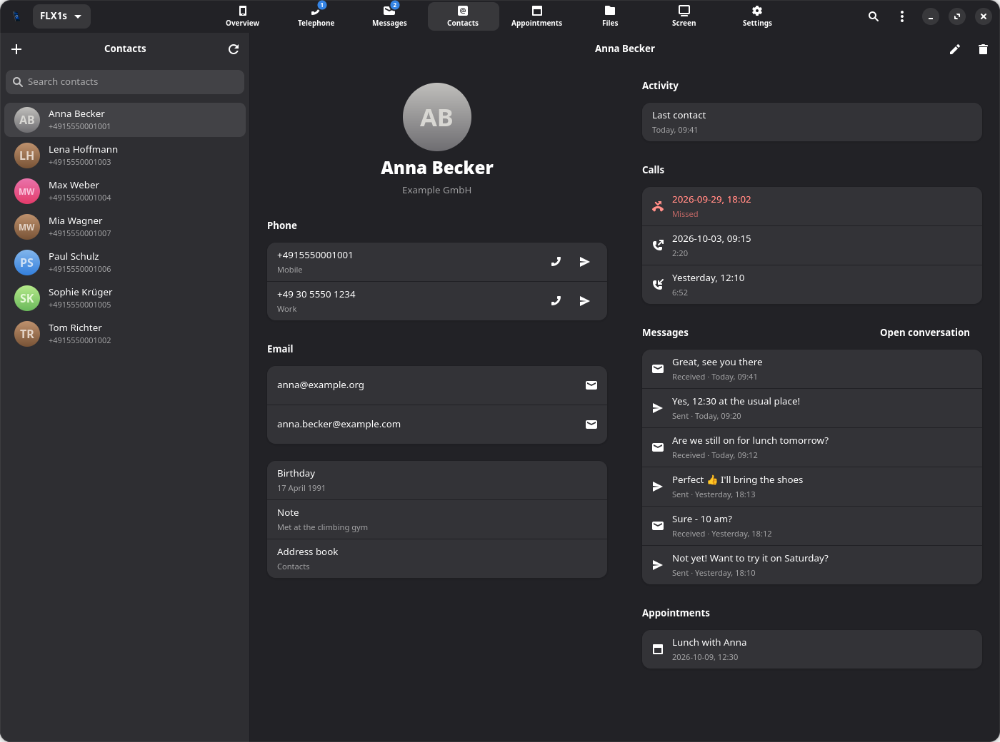
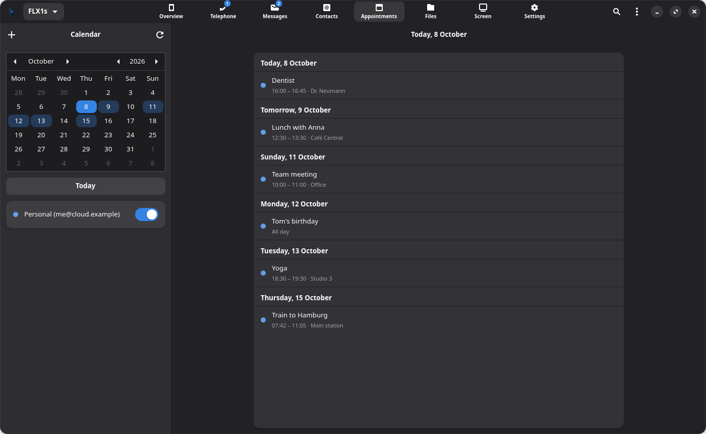
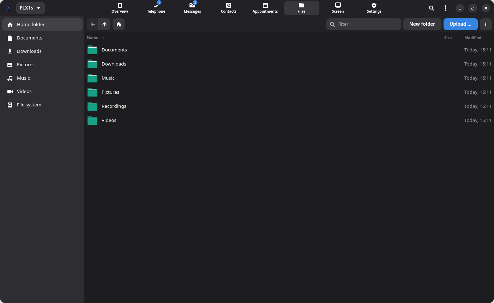
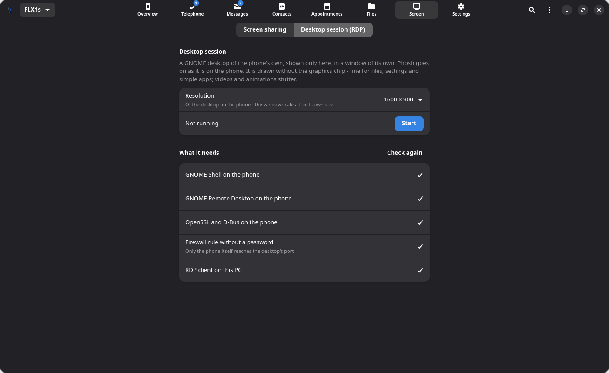
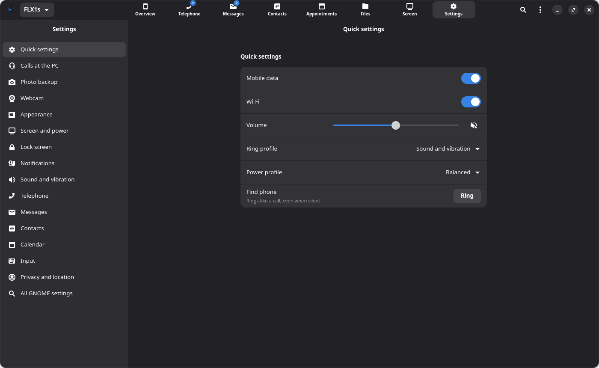

# PhoneBridge


---
⚠️ **AI-assisted project**  
Under active development. Features may change and instability is possible.

---

Your Linux phone on your Linux desktop: battery and messages in the panel, and a window for
calls, SMS, contacts, appointments and the phone's settings - over SSH, with nothing to
install on the phone.



<sub>The screenshots show invented people and data (`tools/screenshot-demo.py`,
light and dark joined by `tools/screenshot-diagonal.py`).</sub>

Made for Phosh phones, and explicitly for the **FuriLabs FLX1 / FLX1s** running FuriOS -
that is where it is developed and tested. Other Phosh phones with the same stack (ofono,
chatty, GNOME Calls, evolution-data-server) may work, but are not tested; calls at the PC
need the FLX1's call audio. On the PC it runs on any desktop and adapts to it (see
[Desktops](#desktops)).

### Every page

| | |
|:---:|:---:|
| <a href="data/screenshots/phone.png"></a><br>**Telephone** - the line to call over (SIM 1, SIM 2, SIP), dial pad and recent calls | <a href="data/screenshots/messages.png"></a><br>**Messages** - a conversation, the others by day |
| <a href="data/screenshots/contacts.png"></a><br>**Contacts** - a contact with its calls, messages and appointments | <a href="data/screenshots/calendar.png"></a><br>**Appointments** - month and agenda |
| <a href="data/screenshots/files.png"></a><br>**Files** - the phone's home folder | <a href="data/screenshots/screen.png"></a><br>**Screen** - screen sharing or a desktop session |
| <a href="data/screenshots/settings.png"></a><br>**Settings** - the phone's settings | |

## Features

- **Panel icon** - a phone that fills up with the battery level, a bolt while charging, a badge
  for unread messages and new voice messages, details in the tooltip, a menu for the rest.
- **Overview** - battery, mobile network, Wi-Fi and connection at a glance; the last calls,
  conversations and the next appointments in two or three columns. New or current entries
  carry a blue edge.
- **Telephone** - dial pad with the line to call over (SIM 1, SIM 2, SIP accounts), the call
  history with VoiceBox's voice messages in their places, answer and hang up a call in
  progress, and - where the phone allows it - talk at the PC instead of the phone.
- **Messages** - chatty's SMS conversations with profile pictures: read, reply, write new ones,
  delete whole conversations.
- **Contacts** - all address books of the phone (local and synced: CardDAV, Google …): look up,
  call, write (an email opens the PC's mail program), add, change and delete, with photos.
  Beside a contact - below it in a narrow window - what there is with the person: last
  contact, calls and voice messages, the last messages, appointments that name them. A click
  on a person's picture anywhere in the app opens their contact.
- **Appointments** - all calendars of the phone as month and agenda: add, change and delete
  appointments with reminders; recurring ones as a series or a single day.
- **Files** - the phone's folders with thumbnails: open a file on the PC (a changed copy can
  go back with one click), download, upload (also by dragging files onto the window), new
  folder, rename, delete. Transfers show their progress and can be cancelled.
- **Settings** - quick switches (mobile data, Wi-Fi, volume, ring and power profile, find the
  phone), and the phone's own settings section by section: appearance, screen and power,
  lock screen, notifications (per app too), sound and vibration, GNOME Calls and its SIP
  accounts, Chatty, contacts, calendar reminders, keyboard, privacy and location - plus a
  search over every GSettings key.
- **Phone links** - `tel:`, `callto:` and `sms:` links anywhere on the desktop (browser, mail)
  open in PhoneBridge: the number in the dial pad, one click to call; the conversation with
  the link's text.
- **Music** - what plays on the phone (any MPRIS player), with back, play/pause and next in
  the overview and the panel menu - and a switch for where it plays: the phone's speaker or
  this PC's. Ringing, notifications and calls stay on the phone; the choice is kept per phone.
- **Photo backup** - new photos and videos of the phone's camera come to a folder on the PC
  by themselves, every half hour while the phone is on Wi-Fi; what was backed up once is
  not fetched again (*Settings → Photo backup*).
- **Clipboard** - text to the phone or from it by hand (panel menu, window menu), or shared
  both ways by itself once switched on (*Menu → Share the clipboard with the phone*; off
  by default - passwords pass through clipboards).
- **Send to the phone** - a web link opens in the phone's browser, files and folders land in
  its Downloads (never over an existing file) with a notification there. From the panel
  menu, the window's menu, Thunar's *Send To* menu or `phonebridge --send FILE|URL …`.
- **Notifications** on the desktop for new messages, calls, voice messages, a full battery
  and one running empty - with the person's picture, text buttons, gone after 10 seconds.
  The phone's other apps too (messengers, mail, calendar …): *Close on the phone* closes one
  there, and one closed on the phone goes here as well. *Menu → Show the phone's
  notifications* turns that off.
- **Webcam** - the phone's front or back camera as this PC's webcam (*Settings → Webcam* or
  the panel menu): in every program once a virtual camera is set up (v4l2loopback - the
  app does it with one password prompt), else as a PipeWire camera (OBS, GNOME Snapshot …).
  720p H.264 over SSH, the camera on only while it is used. *Test …* shows the live
  picture as programs get it, with its size and pictures a second.
- **The phone's screen** - live on the *Screen* page, and usable from the PC: a click taps,
  dragging swipes (Phosh's swipes from the edges too), holding is a long press, the mouse
  wheel scrolls, keys typed there are typed on the phone. Buttons for power, the app
  overview and the volume, for turning the phone between portrait and landscape, and for
  full screen (Esc goes back); three picture qualities. The picture runs only while the page is
  shown, and the phone's screen stays on meanwhile.
- **A desktop of the phone's own** - the other way on the *Screen* page: a GNOME desktop
  started on the phone without a screen and shown here in an RDP window (FreeRDP 3), in a
  resolution chosen beforehand (720p upwards). Phosh goes on as it is; the desktop has its
  own D-Bus and dconf database, but the user's files and apps. It is drawn without the
  graphics chip - fine for files, settings and simple apps. What is missing on the phone
  or the PC is listed, with the commands that set it up.
- **Screenshot of the phone** - from the panel or window menu, shown on the PC to copy or
  save (while the phone's screen is on and unlocked).
- **Hotspot** - switch the phone's hotspot from *Settings → Quick settings*, and keep it on
  this PC once (the password, asked once): NetworkManager then joins it by itself whenever
  it is on and no other known Wi-Fi is there, and PhoneBridge reaches the phone through it.
- **Search everything** (Ctrl+K or the search button) - contacts, conversations and the
  messages' text, calls, appointments and the phone's files at once.
- **Several phones**, one of them shown in the panel. English and German.

## How it works

Nothing is installed on the phone and no port is opened there. PhoneBridge starts `python3`
on the phone over SSH and feeds it `phonebridge/agent.py`; the agent answers JSON lines on
the same connection and reports changes by itself. It reads and changes what the phone's own
apps use:

| What | On the phone |
|---|---|
| Battery | UPower |
| Network, mobile data, calls in progress, incoming SMS | ofono |
| Sending SMS | ModemManager (as chatty does) |
| SMS history | chatty's SQLite store |
| Contacts, appointments | evolution-data-server over D-Bus - changes sync to the accounts |
| Call history | GNOME Calls' `records.db` (read only) |
| Lines | SIM cards by ICCID (ofono), SIP accounts of GNOME Calls |
| Voice messages | [VoiceBox](https://github.com/misc-de/VoiceBox), when it is installed |
| Wi-Fi, volume, ring profile, power profile | NetworkManager, WirePlumber, feedbackd, power-profiles |
| Settings | GSettings |
| Music | MPRIS players on the session bus; on the PC: the players' streams (`target.object`) into a pw-record sink → raw 48 kHz stereo over SSH → pw-play |
| Clipboard | wl-copy / wl-paste (the compositor's data-control) |
| Screenshot | grim (wlr-screencopy), else Phosh's screenshot service |
| Screen | wf-recorder (wlr-screencopy, x264, only changed pictures) → FLV over SSH → GStreamer on the PC; taps and keys back through a virtual touchscreen and keyboard (uinput, python3-evdev) |
| Desktop session | gnome-shell --headless and GNOME Remote Desktop on a D-Bus of their own; RDP through SSH (one ssh per connection - the phone's sshd forwards no ports); the port closed to the network by an iptables rule while it runs |
| Webcam | droidcamsrc → x264 (zero latency) → H.264 over SSH; on the PC GStreamer (slice decoding, ~50 ms) → v4l2loopback or PipeWire |
| Hotspot | NetworkManager on the phone; on the PC a profile over NetworkManager's D-Bus API |
| The phone's notifications | watched on the session bus (a D-Bus monitor), closed through the notification daemon |
| Files | the file system, as the phone's user; contents over an SSH connection of their own |

Changing chatty's store or GNOME Calls' accounts needs the app to be stopped meanwhile;
PhoneBridge does that for a moment and starts it again exactly as it ran - never during a call.

## Desktops

PhoneBridge looks at the desktop it runs on and adapts:

| | |
|---|---|
| Panel icon | a StatusNotifierItem - Xfce (Status Tray Plugin), KDE Plasma, Cinnamon, MATE (Notification Area), Budgie, LXQt, waybar … show it. When no panel shows it, PhoneBridge says once what would (on GNOME the *AppIndicator and KStatusNotifierItem Support* extension) and keeps running in the background. |
| Notifications | a click on the notification where the daemon takes one (GNOME, KDE, Cinnamon, dunst, mako …); buttons with words where it would show an empty button (xfce4-notifyd, MATE). |
| Light or dark | the color-scheme setting where the desktop has it (GNOME, KDE, Cinnamon, Budgie …); elsewhere (Xfce, MATE, LXDE, LXQt) the dark theme's name or *prefer dark* in GTK's settings. |
| Send to the phone | Thunar's *Send To*, Nautilus and Caja scripts, Nemo actions, Dolphin's service menu, PCManFM's actions - for the file managers that are there. |
| Messages at the start | zenity, or kdialog on KDE. |

*About PhoneBridge → Troubleshooting* shows what was recognised.

## Requirements

**On the PC** - checked at every start; what is missing is shown, with the command to install it.

| | Arch / Manjaro | Debian / Ubuntu |
|---|---|---|
| Required | `python-gobject gtk4 libadwaita python-cairo openssh` | `python3-gi gir1.2-gtk-4.0 gir1.2-adw-1 python3-cairo openssh-client` |
| Passwords in the keyring | `libsecret` | `gir1.2-secret-1` |
| Calls at the PC | `pipewire` (`pw-record`, `pw-play`), `libpulse` (`pactl`) | `pipewire-bin`, `pulseaudio-utils` |
| The phone's screen | `gst-plugins-good gst-plugins-bad gst-libav` | `gir1.2-gstreamer-1.0 gstreamer1.0-plugins-good gstreamer1.0-plugins-bad gstreamer1.0-libav` |
| Desktop session | `freerdp` (FreeRDP 3); on the phone `gnome-shell gnome-remote-desktop` | `freerdp3-x11`; on the phone `gnome-shell gnome-remote-desktop` |
| Webcam | `gst-plugins-bad gst-libav gst-plugin-pipewire`; for every program `v4l2loopback-dkms v4l2loopback-utils` and the kernel's headers (Manjaro: `linuxXY-headers`) | `gir1.2-gstreamer-1.0 gstreamer1.0-plugins-bad gstreamer1.0-libav gstreamer1.0-pipewire v4l2loopback-dkms v4l2loopback-utils` |

Fedora: `python3-gobject gtk4 libadwaita python3-cairo openssh-clients` (and `libsecret`,
`pipewire-utils`, `pulseaudio-utils`); openSUSE: `python3-gobject typelib-1_0-Gtk-4_0
typelib-1_0-Adw-1 python3-pycairo openssh-clients`. PhoneBridge names the missing ones with
the command for the distribution it runs on.

**On the phone** - an SSH server, Python 3 with PyGObject, and the usual mobile stack (ofono,
ModemManager, chatty, GNOME Calls, evolution-data-server), as FuriOS brings them.

**Calls at the PC** need PipeWire running on the phone with the call audio nodes
`droid-call-sink` / `droid-call-source` (a patched spa-droid plugin on the FLX1);
without them the option is not offered.

## Install

On the desktop, as your user (not root) - one line:

```sh
curl -fsSL https://raw.githubusercontent.com/misc-de/PhoneBridge/main/install.sh | bash
```

It installs into `~/.local` only, puts PhoneBridge in the menu and starts it at login
(`… | NO_AUTOSTART=1 bash` leaves that out). Nothing is installed on the phone.

**Updates** - PhoneBridge looks on GitHub for a newer version (a minute after the start, then
every six hours). When there is one, *Update available* shows at the top left of the window;
a click lists the changes and asks, and PhoneBridge installs the update and starts anew.
*Menu → Look for updates* turns that off. Running the install line again updates as well.

Or from a checkout:

```sh
git clone https://github.com/misc-de/PhoneBridge.git
cd PhoneBridge && ./install.sh
```

At the first start PhoneBridge asks for the phone's address and user (`furios` on FuriOS) and
connects right away. If the phone does not take the PC's SSH key yet, it asks for the password
once and puts the key on the phone (like `ssh-copy-id`); without an SSH key on the PC it offers
to make one. More phones: *Menu → Phones …*.

```sh
phonebridge --background    # the panel icon only (autostart)
phonebridge --calendar      # straight to a page: --overview, --phone, --messages,
                            # --contacts, --calendar, --files, --settings
phonebridge --quit          # ends the running instance
./uninstall.sh              # PURGE=1 also removes the settings
```

## Privacy and security

- Only SSH, with your key (or a password kept in the desktop's keyring - never in a file of
  PhoneBridge's; ssh gets it through `SSH_ASKPASS`). An unknown phone's host key is learnt on
  first contact, a changed one is refused.
- Besides SSH to the phone, PhoneBridge only talks to GitHub: to look for updates (unless
  switched off) and to fetch one when you say so.
- Nothing listens on the phone or the PC. The agent runs only while connected and ends when the
  PC goes away (the phone's microphone is never left muted).
- Texts from others (SMS, names, network names) are never read as markup; numbers are checked
  before they are dialled.
- Files with personal data are readable by you only: caches on the PC, the log of sent SMS on
  the phone. Deleting a conversation leaves no copy behind.

## Development

```sh
tests/run-tests.sh            # all tests - no phone, no network, no root
tests/run-tests.sh test_pim   # one module
tests/coverage.sh             # coverage, the agent's process included
```

The tests run the agent on the PC against made-up data, with stand-ins for ssh, chatty,
GNOME Calls, PipeWire and evolution-data-server, on a private D-Bus - your settings, keyring,
`~/.ssh` and desktop are never touched. The window tests need a display but never show a window.

`kill -USR1 <pid>` makes a running instance write its Python stacks to
`~/.cache/phonebridge/stacks.txt`.

Texts are written in English in the code and translated in `phonebridge/lang_de.py`;
`tests/test_i18n.py` checks that every text has its German.

## License

[MIT](LICENSE) © 2026 misc-de
