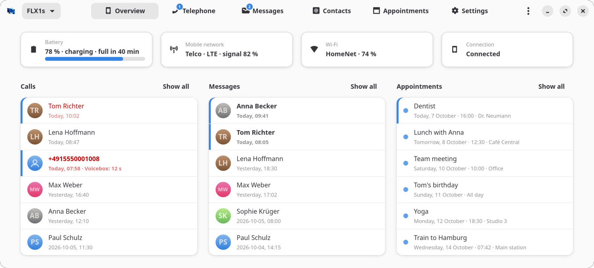

# PhoneBridge

Your Linux phone on your Linux desktop: battery and messages in the panel, and a window for
calls, SMS, contacts, appointments and the phone's settings - over SSH, with nothing to
install on the phone.

<picture>
  <source media="(prefers-color-scheme: dark)" srcset="data/screenshots/overview-dark.png">
  
</picture>

<sub>The screenshot shows invented people and data (`tools/screenshot-demo.py`).</sub>

Made for phones running FuriOS, Phosh or another GNOME-based mobile Linux (FuriLabs FLX1 /
FLX1s, PinePhone, Librem 5 …) and desktops with a status tray (Xfce, KDE, Cinnamon, MATE,
Budgie, waybar …).

## Features

- **Panel icon** - a phone that fills up with the battery level, a bolt while charging, a badge
  for unread messages and new voice messages, details in the tooltip, a menu for the rest.
- **Overview** - battery, mobile network, Wi-Fi and connection at a glance; the last calls,
  conversations and the next appointments in two or three columns. New or current entries
  carry a blue edge.
- **Telephone** - dial pad with the line to call over (SIM 1, SIM 2, SIP accounts), the call
  history with VoiceBox's voice messages in their places, answer and hang up a call in
  progress, and - where the phone allows it - talk at the PC instead of the phone.
- **Messages** - chatty's SMS conversations with profile pictures: read, reply, write new ones,
  delete whole conversations.
- **Contacts** - all address books of the phone (local and synced: CardDAV, Google …): look up,
  call, write, add, change and delete, with photos.
- **Appointments** - all calendars of the phone as month and agenda: add, change and delete
  appointments with reminders; recurring ones as a series or a single day.
- **Settings** - quick switches (mobile data, Wi-Fi, volume, ring and power profile, find the
  phone), and the phone's own settings section by section: appearance, screen and power,
  lock screen, notifications (per app too), sound and vibration, GNOME Calls and its SIP
  accounts, Chatty, contacts, calendar reminders, keyboard, privacy and location - plus a
  search over every GSettings key.
- **Notifications** on the desktop for new messages, calls, voice messages, a full battery
  and one running empty - with the person's picture, text buttons, gone after 10 seconds.
- **Several phones**, one of them shown in the panel. English and German.

## How it works

Nothing is installed on the phone and no port is opened there. PhoneBridge starts `python3`
on the phone over SSH and feeds it `phonebridge/agent.py`; the agent answers JSON lines on
the same connection and reports changes by itself. It reads and changes what the phone's own
apps use:

| What | On the phone |
|---|---|
| Battery | UPower |
| Network, mobile data, calls in progress, incoming SMS | ofono |
| Sending SMS | ModemManager (as chatty does) |
| SMS history | chatty's SQLite store |
| Contacts, appointments | evolution-data-server over D-Bus - changes sync to the accounts |
| Call history | GNOME Calls' `records.db` (read only) |
| Lines | SIM cards by ICCID (ofono), SIP accounts of GNOME Calls |
| Voice messages | [VoiceBox](https://github.com/misc-de/VoiceBox), when it is installed |
| Wi-Fi, volume, ring profile, power profile | NetworkManager, WirePlumber, feedbackd, power-profiles |
| Settings | GSettings |

Changing chatty's store or GNOME Calls' accounts needs the app to be stopped meanwhile;
PhoneBridge does that for a moment and starts it again exactly as it ran - never during a call.

## Requirements

**On the PC** - checked at every start; what is missing is shown, with the command to install it.

| | Arch / Manjaro | Debian / Ubuntu |
|---|---|---|
| Required | `python-gobject gtk4 libadwaita python-cairo openssh` | `python3-gi gir1.2-gtk-4.0 gir1.2-adw-1 python3-cairo openssh-client` |
| Passwords in the keyring | `libsecret` | `gir1.2-secret-1` |
| Calls at the PC | `pipewire` (`pw-record`, `pw-play`), `libpulse` (`pactl`) | `pipewire-bin`, `pulseaudio-utils` |

**On the phone** - an SSH server, Python 3 with PyGObject, and the usual mobile stack (ofono,
ModemManager, chatty, GNOME Calls, evolution-data-server), as FuriOS and Phosh bring them.

**Calls at the PC** need PipeWire running on the phone with the call audio nodes
`droid-call-sink` / `droid-call-source` (a patched spa-droid plugin on FuriLabs phones);
without them the option is not offered.

## Install

```sh
./install.sh        # into ~/.local; starts at login (NO_AUTOSTART=1 to leave that out)
phonebridge         # or from the menu
```

At the first start PhoneBridge asks for the phone's address and user (`furios` on FuriOS) and
connects right away. If the phone does not take the PC's SSH key yet, it asks for the password
once and puts the key on the phone (like `ssh-copy-id`); without an SSH key on the PC it offers
to make one. More phones: *Menu → Phones …*.

```sh
phonebridge --background    # the panel icon only (autostart)
phonebridge --calendar      # straight to a page: --overview, --phone, --messages,
                            # --contacts, --calendar, --settings
phonebridge --quit          # ends the running instance
./uninstall.sh              # PURGE=1 also removes the settings
```

## Privacy and security

- Only SSH, with your key (or a password kept in the desktop's keyring - never in a file of
  PhoneBridge's; ssh gets it through `SSH_ASKPASS`). An unknown phone's host key is learnt on
  first contact, a changed one is refused.
- Nothing listens on the phone or the PC. The agent runs only while connected and ends when the
  PC goes away (the phone's microphone is never left muted).
- Texts from others (SMS, names, network names) are never read as markup; numbers are checked
  before they are dialled.
- Files with personal data are readable by you only: caches on the PC, the log of sent SMS on
  the phone. Deleting a conversation leaves no copy behind.

## Development

```sh
tests/run-tests.sh            # all tests - no phone, no network, no root
tests/run-tests.sh test_pim   # one module
tests/coverage.sh             # coverage, the agent's process included
```

The tests run the agent on the PC against made-up data, with stand-ins for ssh, chatty,
GNOME Calls, PipeWire and evolution-data-server, on a private D-Bus - your settings, keyring,
`~/.ssh` and desktop are never touched. The window tests need a display but never show a window.

`kill -USR1 <pid>` makes a running instance write its Python stacks to
`~/.cache/phonebridge/stacks.txt`.

Texts are written in English in the code and translated in `phonebridge/lang_de.py`;
`tests/test_i18n.py` checks that every text has its German.

## License

[MIT](LICENSE) © 2026 misc-de
